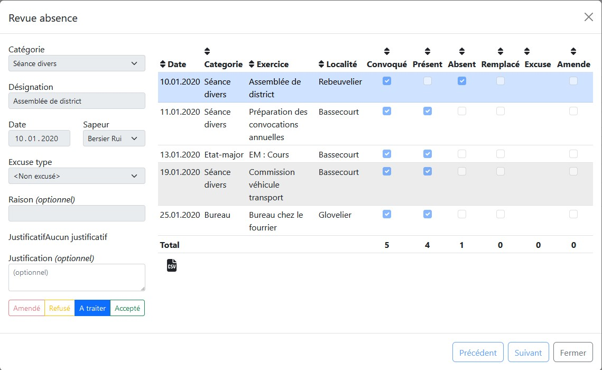

Le module `Exercices & séances` a comme but principal la planification, le suivi des exercices et séances ainsi que des convocations, présences, excuses et amendes.

L'interface principale du module permet la visualisation de l'ensemble des exercices et séances planifiées. L'idée étant de saisir les exercices une fois en début d'année puis de compléter la liste des présences après chaque événement.

Lors de la saisie des présences, vous devez choisir l'une des trois possibilités `Présent`, `Absent` ou `Remplacé`.
Chaque sapeur pourra ensuite ajouter une excuse si le sous-module `Excuse` a été activée (voir point `Sous-module excuse` plus bas).

<!-- TODO: Heures supp pour exercice -->

## Validation

Le principe des 4 yeux est appliqué ainsi une fois un événement est saisi, une validation est nécessaire afin de pouvoir le facturer dans le module `Comptabilité`.
Le bouton permettant de valider un événement se trouve en fin de ligne.

!!!
Pour pouvoir valider un exercice, il est nécessaire au préalable que chaque sapeur convoqué soit marqué comme `Présent`, `Absent` ou `Remplacé`.
!!!

## Annulation

Il est possible d'annuler un exercice ou séance avec le bouton annuler.
L'exercice ne pourra ainsi plus être modifié et n'apparaitra pas dans la compatbilité.

## Traitement des absences

Une interface permet de faciliter le traitement des absences en fin d'année.
En allant dans l'onglet `Absences`, il est possible de visualiser l'ensemble des absences et le bouton `Examiner les excuses non-traitées` permet de revoir les absence à la chaîne.

L'avantage de cette vue est qu'elle offre toutes les informations nécessaire à son traitement, avec un résumé des convocations du sapeurs. L'absence peut ensuite être `Accepté`, `Refusé (sans amende)` et `Amendé`.

## Sous-module excuse

Ce sous-module activable dans `configuration > exercice` permet de donner la possibilités à chaque utilisateur de s'excuser à ses propres exercices.
Ainsi lorsque sapeur ira dans `mes exercices` il aura un bouton lui permettant de saisir une excuse avec un fichier justificatif.

## Configuration

Voici l'ensemble des paramètres disponible dans la configuration

- Catégories d'exercices et leur durée de base
- Excuses types et sous-module excuse

## Permissions

Voici les 4 permissions existantes :

- Lecture : Visualisation de l'ensemble des exercices sans possibilité de modification
- Présences : Permets la saisie des présences aux exercices non validé
- Modification : Permet la création/modification et la saisie des présences aux exercices
- Validation : Permet de valider un exercice et de traiter les absences
- Configuration : Pour configurer les excuses types, l'activation du système d'excuse et des catégories d'exercices
