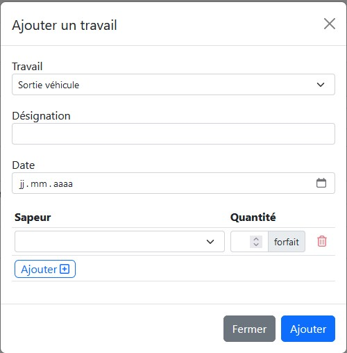

:warning: En cours de rédaction :warning:

L'idée de ce module est de simplifier la saisie des travaux effectué hors exercices et séances planifiées.
Un exemple sont les travaux de maintenance ou les roulages de véhicules.

Pour commencer à utiliser ce module, il est nécessaire de configurer les différents types souhaités dans `Configuration`.
Une fois effecté, il est possible de saisir directement les travaux effectués.

Il existe deux permissions différentes pour ajouter des travaux, `saisie personelle` permettant de saisir uniquement un travail pour soi-même et `saisie commune` permettant de saisir pour plusieurs personnes.

Les travaux doivent être validé afin de pouvoir être comptabilisé.

## Configuration

Les différents travaux types disponibles sont à saisir et paramétrer dans `Configuration`.

## Permissions

Voici les 4 permissions existantes :

- Lecture : Visualisation des travaux saisi par l'ensemble des sapeurs
- Saisie personnelle : Permets la saisie de travaux uniquement pour sa propre personne
- Saisie commune : Permet la saisie de travaux pour n'importe qui
- Validation : Permet de valider les fiches de travail
- Configuration : Pour configurer les travaux types
