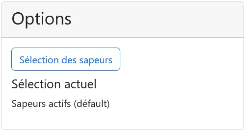

Le but du module publipostage est de permettre la récupération toutes les données sapeurs nécessaires au publipostage.

Pour ce faire, ce module offre la possibilité de récupérer ces données au format `Excel (.xlsx)` via un simple clique sur le bouton [!badge Fichier Excel].

## Filtres

Par défault, l'ensemble des sapeurs sont sélectionné mais il est possible de restreindre la sélection !

Pour ce faire, à droite de la fenêtre se trouve la section [!badge option].

Lors du clic sur le bouton [!badge Sélection des sapeurs], la fenêtre de sélection va s'ouvrir permettant de choisir les sapeurs voulus.

[!ref icon="rocket" text="Fenêtre de sélection"](../outils/fenetre-selection.md)

Il est possible de réinitialiser la sélection des sapeurs à l'aide du bouton `Réinitialiser la sélection`.