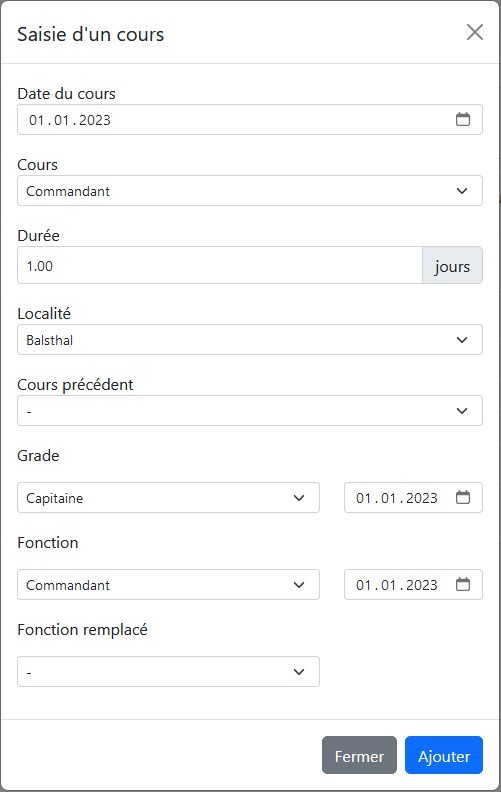

# Sapeur

:warning: En cours de rédaction :warning:

Ce module permet la gestion de l'ensembles des sapeurs et civiles qui collaborent avec le SIS.

Il existe actuellement deux types de personnes, les [!badge sapeurs] et les [!badge politiques].

!!! Informations
La [!badge fonction principale], le [!badge grade actuel] et le statut [!badge actif] sont mis à jour automatiquement respectives aux fonctions, promotions et mutations saisies, et ne peuvent être modifié directement.
!!!

## Mutations (Démission)

Les mutations permettent de gérer les déménagements ainsi que les départs du SIS.
Lors du clic sur le bouton [!badge Fin de service], il est possible de supprimer les exercices restants du sapeurs ainsi que de mettre fin à ses fonctions.

## Cours

Lors de l'ajout d'un cours, l'interface permet de générer une promotion (grade) ainsi que de générer une nouvelle fonction.
Les données sont configurées de base mais il est possible de les modifier.

## Contrôles médicaux

Les utilisateurs ayant accès au module `Contrôles médicaux` auront un onglet supplémentaire leur permettant de visualiser les contrôles du sapeur.

## Permissions

Voici les 3 permissions existantes :

- Lecture : Visualisation de l'ensemble des données sapeurs
- Modification : Permets la modification des données sapeurs
- Configuration : Pour configurer les fonctions, grades et cours

## Configuration

Sous configurations vous avez la possibilité de configurer les données suivantes :
- Liste des fonctions
- Liste des grades
- Liste des cours

### Cours

Les cours permettent de configurer la période durant laquelle ils ont été enseigné ainsi que le [!badge grade] et la [!badge fonction] auxquelles ils donnent accès.
