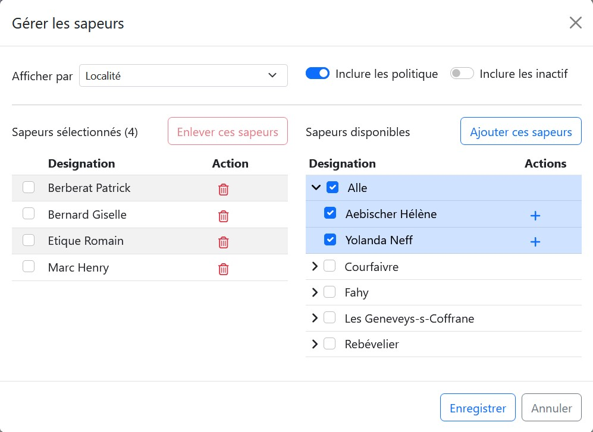

La fenêtre de sélection permet de sélectionner un sous-ensemble de sapeurs et est commune à plusieurs modules.

Cette fenêtre est séparé en 3 parties, les options (en haut), la liste des sapeurs sélectionnés (à gauche) et les sapeurs disponible (à droite), regarder l'image ci-dessous :

Pour sélectionner des sapeurs et les faire passer dans la liste de gauche, il y a deux manières possibles :
1. Cliquer sur le bouton [!badge +] à côté du nom du sapeur
2. Sélectionner un ou plusieurs sapeurs via leurs case à coché puis cliquer sur [!badge Ajouter ces sapeurs]

Une fois les sapeurs sélectionnés, il ne reste plus qu'à valider la sélection à l'aide du bouton [!badge Enregistrer].